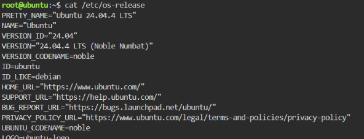
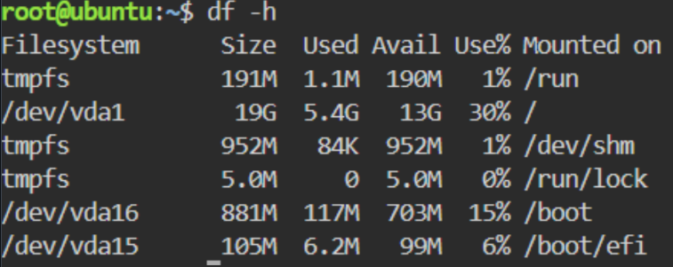

# Checkpoint 7 – Continue Your Linux Investigation

## Linux Server Investigation

A Linux server was examined using the **KillerCoda Playground** and basic Linux commands. The goal was to check important information about the server, including its operating system, CPU, memory, and available disk space.

### Operating System

Command used:

```bash
cat /etc/os-release
```

This command was used to find out which operating system and version are installed on the Linux server.



### CPU Information

Command used:

```bash
lscpu
```

This command was used to check the CPU architecture, processor details, and the number of CPUs available on the server.


### Memory

Command used:

```bash
free -h
```

This command was used to view the server's total memory, the amount currently being used, and the available memory.


### Disk Space

Command used:

```bash
df -h
```

This command was used to check the server's total disk space, used space, available space, and mounted file systems.



### Cloud Migration Options

If this Linux server were moved to the cloud, it could be hosted using virtual machine services from AWS, Microsoft Azure, or Google Cloud.

| Cloud Provider  | Cloud Service          | Purpose                                    |
| --------------- | ---------------------- | ------------------------------------------ |
| AWS             | Amazon EC2             | Runs the Linux server as a virtual machine |
| Microsoft Azure | Azure Virtual Machines | Hosts and runs the Linux server            |
| Google Cloud    | Compute Engine         | Runs the Linux server as a virtual machine |

All three cloud providers support Linux-based virtual machines. The best option would depend on the server's CPU, memory, storage, operating system, workload, cost, scalability, and networking needs.

### Conclusion

The Linux server investigation showed that basic Linux commands can provide useful information about a server's operating system, CPU, memory, and disk space. These details are important when planning to move a server to the cloud because they can help determine the right virtual machine configuration. AWS EC2, Azure Virtual Machines, and Google Compute Engine are all capable of hosting the Linux server in a cloud environment.
